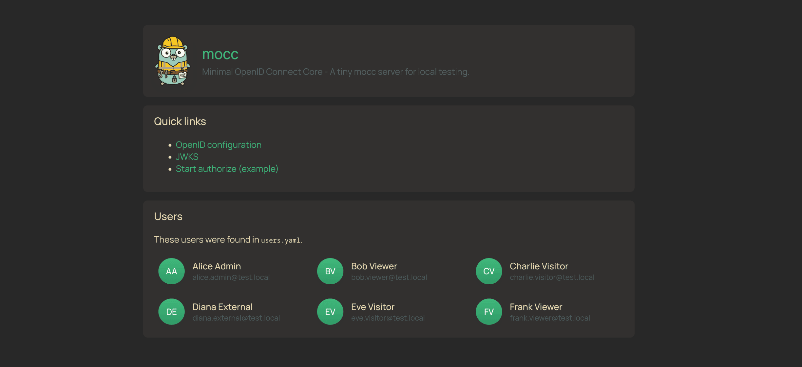
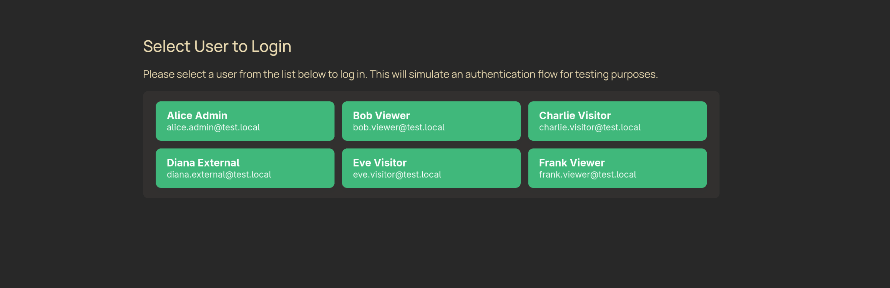

<div align="center">
  <h1 align="center">mocc</h1>
  
  <br>
  <a href="#overview">About</a> •
  <a href="#get-started">Get Started</a> •
  <a href="#configuration">Config</a>

<br />

  [](https://github.com/jonasbg/mocc/actions/workflows/release-binaries.yml)
</div>

## Overview

Minimal OpenID Connect Core (mocc) is a tiny, opinionated mock OpenID Connect (OIDC) provider implemented in Go. It's meant for local development and testing when you need a simple issuer that supports the authorization code flow, a JWKS endpoint, and short-lived ID tokens.

Keep it simple — the server ships as a tiny binary (<5MB) and a small `users.yaml` for test accounts.

> [!WARNING]
> Do not install this in a production environment! This is only meant for local development.  
> Use at your own risk — unless you enjoy explaining to your security team why your “mock OIDC” is suddenly the real one.

## Features

- Authorization code flow (mock login)
- Issues RS256-signed ID tokens
- Exposes `/jwks.json` and `/.well-known/openid-configuration`
- Simple YAML-based user configuration (`users.yaml`)
- Small Docker image (final image uses `FROM scratch`)
- PKCE supported (S256 recommended; 'plain' allowed for testing only, with warning)

## Get Started

### git going fast

```bash
docker run -d --port 9999:9999 ghcr.io/jonasbg/mocc
```

Then use the localhost:9999 as oidc provider in your config such as:
```yaml
oidc:
  clientID: "any-client-id-is-accepted"
  clientSecret: "no-secret-is-needed"
  redirectUri: "http://localhost:5173/api/callback"
  providerUri: "http://localhost:9999"
```

For local development, this mock server accepts any client ID and secret to keep setup quick and simple.

### DevContainer Feature

Add MOCC as a [DevContainer Feature](https://containers.dev/implementors/features/) to automatically install it in your development container:

```json
{
    "features": {
        "ghcr.io/jonasbg/mocc/mocc:1": {}
    }
}
```

With options and port forwarding:

```json
{
    "features": {
        "ghcr.io/jonasbg/mocc/mocc:1": {
            "version": "latest",
            "port": "9999",
            "autostart": true
        }
    },
    // Silently open PORT
    "portsAttributes": {
        "9999": {
          "label": "mOCC OIDC Provider",
          "onAutoForward": "silent"
        },
      },    
    "forwardPorts": [9999], //auto open ports into container
}
```

| Option | Type | Default | Description |
|--------|------|---------|-------------|
| `version` | string | `latest` | Version to install (e.g., `latest`, `v1.0.0`) |
| `port` | string | `9999` | Port for MOCC to listen on |
| `autostart` | boolean | `false` | Start MOCC automatically when container starts |
| `users` | string | `` | Path to custom users.yaml file (e.g., `/config/users.yaml`) |

When `autostart` is enabled, MOCC binds to `0.0.0.0` so it's accessible via port forwarding. If running manually inside the container, use `mocc --host 0.0.0.0` to expose it to the host.

To use a custom users file from your repository, point to it within the workspace:

```json
{
    "forwardPorts": [9999],
    "features": {
        "ghcr.io/jonasbg/mocc/mocc:1": {
            "users": "${containerWorkspaceFolder}/users.yaml",
            "autostart": true
        }
    }
}
```

Alternatively, set the `MOCC_USERS` environment variable via `containerEnv`:

```json
{
    "forwardPorts": [9999],
    "containerEnv": {
        "MOCC_USERS": "${containerWorkspaceFolder}/users.yaml"
    },
    "features": {
        "ghcr.io/jonasbg/mocc/mocc:1": {
            "autostart": true
        }
    }
}
```

### Build it yourself

Prerequisites:

- Go (for local builds) or Docker (for running the included image)

Run locally with Go:

```bash
go run cmd/mocc/main.go
```

Or run the compiled binary:

```bash
./mocc --help
./mocc --users ./config/users.yaml --port 9999
```

Cross-compile the same binaries produced by CI:

```bash
GOOS=linux GOARCH=amd64 CGO_ENABLED=0 go build -trimpath -ldflags "-s -w" -o dist/mocc-linux-amd64 ./cmd/mocc
GOOS=darwin GOARCH=arm64 CGO_ENABLED=0 go build -trimpath -ldflags "-s -w" -o dist/mocc-darwin-arm64 ./cmd/mocc
GOOS=windows GOARCH=arm64 CGO_ENABLED=0 go build -trimpath -ldflags "-s -w" -o dist/mocc-windows-arm64.exe ./cmd/mocc
```

Build and run with Docker (from repository root):

```bash
docker build -t mocc:latest .
docker run --rm -p 9999:9999 mocc:latest
```

By default the server listens on port 9999 when run with `go run`. When the container runs it exposes port `9999`.

### Tests

Run tests with test coverage

```bash
go test ./... -coverprofile=coverage.out
go tool cover -func=coverage.out
```

## Configuration

The server reads users from a YAML file. By default it looks for `users.yaml` in the working directory or the path set by the `USERS` environment variable.

Override the users file in Docker by mounting a file or directory at `/config`:

```bash
# Mount a single file
docker run --rm -p 9999:9999 -v $(pwd)/users.yaml:/config/users.yaml mocc:latest

# Or mount a directory
docker run --rm -p 9999:9999 -v $(pwd)/config:/config mocc:latest
```

Configuration precedence is command-line flags, then environment variables, then defaults. Flags are available even in the container (`docker run ... mocc --port 9999`).

Each user entry may also define a `claims` map. Any custom claim values you include there (nested objects and arrays are allowed) automatically flow into issued tokens:

```yaml
users:
  - name: "Alice Admin"
    email: "alice.admin@test.local"
    claims:
      roles: ["admin", "tester"]
      tenant: "acme"
      features:
        beta: true
```

### CORS Configuration (Optional)

You can optionally configure CORS (Cross-Origin Resource Sharing) to restrict which origins can access the OIDC endpoints. Add a `config` section to your `users.yaml`:

```yaml
config:
  allow_origins:
    - "http://localhost:5173"
    - "https://app.example.com"

users:
  - name: "Alice Admin"
    email: "alice.admin@test.local"
```

If the `config` section is omitted or `allow_origins` is empty, CORS defaults to allowing all origins (`*`). This is convenient for local development but can be restricted for more controlled testing environments.

Flags:

- `--users` — path to the users YAML file (default: `users.yaml`)
- `--host` — host/IP address to bind to (default: `127.0.0.1`, use `0.0.0.0` to expose to network)
- `--port` — port to listen on (default: `9999`)

Environment variables:

- `MOCC_USERS` or `USERS` — path to the users YAML (default: `users.yaml`, `/config/users.yaml` in Docker)
- `MOCC_HOST` or `HOST` — host/IP address to bind to (default: `127.0.0.1`, use `0.0.0.0` to expose to network)
- `MOCC_PORT` or `PORT` — port to bind (default: `9999`)
- If no users file is found and you rely on defaults, the binary falls back to an embedded copy of `users.yaml` bundled at build time.

# Screenshots

Landing page


Login page


## Quick reference

- Authorization endpoint: /authorize
- Token endpoint: /token
- Direct token minting: /token/{email}
- JWKS endpoint: /jwks.json
- Discovery: /.well-known/openid-configuration

## PKCE (Proof Key for Code Exchange)

This mock server supports PKCE for the authorization code flow. It accepts both S256 and plain methods (plain is supported for testing convenience but is insecure in real deployments).

Example (S256):

1. Choose a code_verifier, e.g. `random-64-chars`.
2. Compute the code_challenge: `base64url_encode_no_padding(sha256(code_verifier))`.
3. Start the authorization request:

```
GET /authorize?response_type=code&client_id=your-client&redirect_uri=http://localhost/cb&code_challenge=<challenge>&code_challenge_method=S256
```

4. After completing the interactive login, exchange the code for tokens:

```
POST /token
Content-Type: application/x-www-form-urlencoded

code=<code>&client_id=your-client&code_verifier=<the-original-verifier>
```

If you use `plain` as `code_challenge_method`, the server will accept it but will log a warning advising to use S256 instead.

## Direct token minting

For quick manual testing, you can mint a token for a known user without running the full authorization flow. Call `GET /token/{email}` with the target email from `users.yaml`. You can optionally include a JSON body containing extra claims you want to override or add.

```bash
curl \
  -X GET "http://localhost:9999/token/alice@example.com" \
  -H "Content-Type: application/json" \
  -d '{
        "aud": "my-client-id",
        "roles": ["tester", "admin"],
        "custom": {
          "featureFlags": ["alpha", "beta"]
        }
      }'
```

Response (trimmed):

```json
{
  "token": "<RS256 signed JWT>",
  "claims": {
    "sub": "alice@example.com",
    "email": "alice@example.com",
    "name": "Alice Example",
    "iss": "http://localhost:9999",
    "aud": "my-client-id",
    "roles": ["tester", "admin"],
    "custom": {
      "featureFlags": ["alpha", "beta"]
    },
    "iat": 1711986320,
    "exp": 1711986620
  }
}
```

The `claims` object mirrors the payload embedded in the signed JWT and reflects any custom values supplied in the request body.

## License

This project is licensed under the MIT License.
